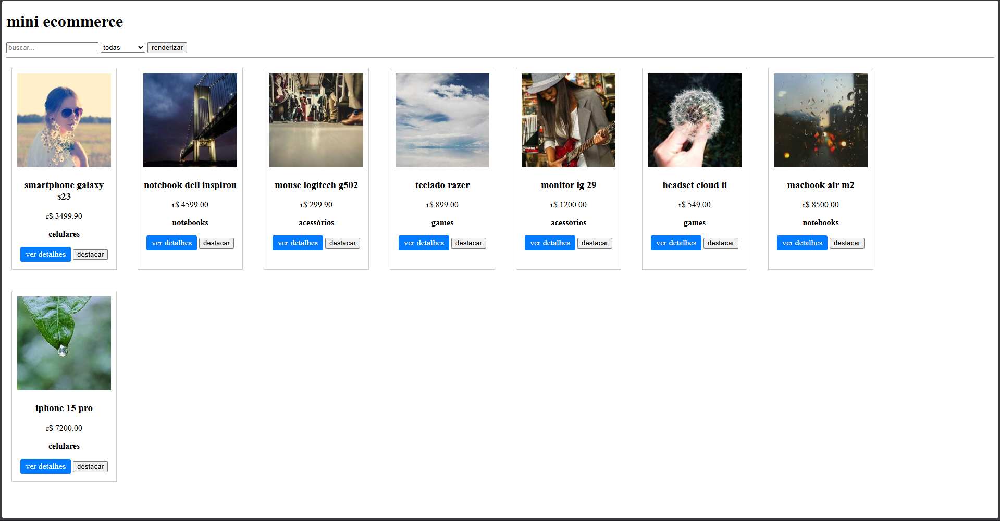
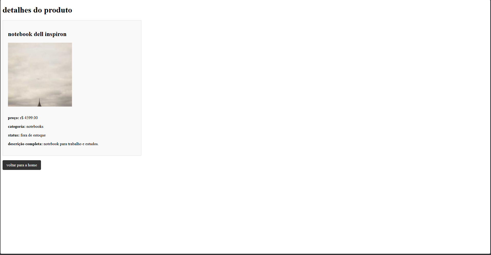

[](https://classroom.github.com/a/jBAz0Mjg)
# Trabalho Prático - Semana 11

Nesta atividade, vamos evoluir o projeto em que estamos trabalhando nesse semestre, acrescentando a página de detalhes.

Imagine que a página principal (home-page) mostre um visão dos vários itens que existem no seu site. Ao clicar em um item, você é direcionado pra a página de detalhes. A página de detalhe vai mostrar todas as informações sobre o item do seu projeto, seja esse item uma notícia, filme, receita, lugar turístico ou evento.

## Informações Gerais

- Nome:Rafael Lima Pais
- Matricula:928393
- Decreva brevemente seu projeto: fiz uma loja de informatica simples, mostrando alguns produtos que coloquei de exemplo e ao clicar em ver detalhes ele abre a aba do detalhes.html 

## Prints do trabalho

<<  COLOQUE A IMAGEM - HOME-PAGE - AQUI >>

<<  COLOQUE A IMAGEM - TELA DE DETALHES - AQUI >>

## Dados em JSON
Inclua aqui a estrutura de dados definida por você para o projeto com pelo menos dois exemplo de dados.

```json
{
  "produtos": [
    { "id": 1, "nome": "smartphone galaxy s23", "preco": 3499.90, "categoria": "celulares", "imagem": "https://picsum.photos/200/200?random=1", "descricao": "celular com 128gb e camera boa.", "emestoque": true },
    { "id": 2, "nome": "notebook dell inspiron", "preco": 4599.00, "categoria": "notebooks", "imagem": "https://picsum.photos/200/200?random=2", "descricao": "notebook para trabalho e estudos.", "emestoque": false },
    { "id": 3, "nome": "mouse logitech g502", "preco": 299.90, "categoria": "acessórios", "imagem": "https://picsum.photos/200/200?random=3", "descricao": "mouse gamer com sensor preciso.", "emestoque": true },
    { "id": 4, "nome": "teclado razer", "preco": 899.00, "categoria": "games", "imagem": "https://picsum.photos/200/200?random=4", "descricao": "teclado mecanico barulhento.", "emestoque": true },
    { "id": 5, "nome": "monitor lg 29", "preco": 1200.00, "categoria": "acessórios", "imagem": "https://picsum.photos/200/200?random=5", "descricao": "monitor largo para ver tudo.", "emestoque": true },
    { "id": 6, "nome": "headset cloud ii", "preco": 549.00, "categoria": "games", "imagem": "https://picsum.photos/200/200?random=6", "descricao": "fone de ouvido para jogar.", "emestoque": true },
    { "id": 7, "nome": "macbook air m2", "preco": 8500.00, "categoria": "notebooks", "imagem": "https://picsum.photos/200/200?random=7", "descricao": "computador muito fino e rapido.", "emestoque": true },
    { "id": 8, "nome": "iphone 15 pro", "preco": 7200.00, "categoria": "celulares", "imagem": "https://picsum.photos/200/200?random=8", "descricao": "celular da apple de titanio.", "emestoque": true }
  ]
}
```


